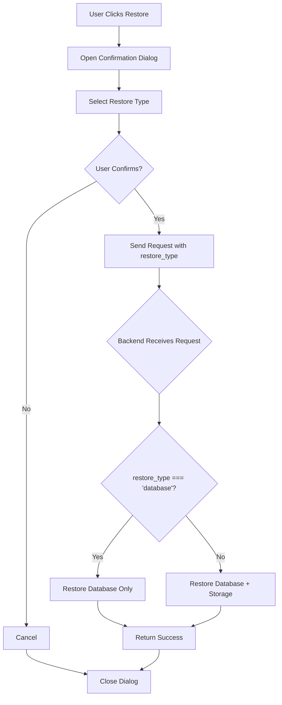

# Add Restore Type Selection Feature

## Overview

Add restore type selection to allow users to choose between:

- **Database Only**: Restore only the database (faster, preserves current storage files)
- **Database + Files**: Restore both database and storage files (complete restore)

## Changes Required

### Backend Changes

#### 1. Update `performRestore()` Method

**File**: `backend/app/Http/Controllers/BackupController.php`

- Add `$restoreStorage` boolean parameter (default: `true` for backward compatibility)
- Conditionally call `restoreStorage()` only if `$restoreStorage === true`
- Update method signature: `private function performRestore(string $backupPath, bool $restoreStorage = true): void`

#### 2. Update `restoreBackup()` Method

**File**: `backend/app/Http/Controllers/BackupController.php` (Line 229)

- Accept `restore_type` from request: `$request->input('restore_type', 'all')` 
- Values: `'database'` (database only) or `'all'` (database + storage)
- Convert to boolean: `$restoreStorage = $request->input('restore_type', 'all') !== 'database'`
- Pass to `performRestore()`: `$this->performRestore($backupPath, $restoreStorage)`

#### 3. Update `uploadAndRestore()` Method

**File**: `backend/app/Http/Controllers/BackupController.php` (Line 264)

- Accept `restore_type` from request: `$request->input('restore_type', 'all')`
- Convert to boolean: `$restoreStorage = $request->input('restore_type', 'all') !== 'database'`
- Pass to `performRestore()`: `$this->performRestore($backupPath, $restoreStorage)`

### Frontend Changes

#### 4. Add Restore Type State

**File**: `frontend/src/platform/pages/admin/PlatformSettings.tsx`

- Add state: `const [restoreType, setRestoreType] = useState<'database' | 'all'>('all')`
- Reset state when dialog closes: `onOpenChange={(open) => { if (!open) { setRestoreType('all'); setRestoringBackupFilename(null); } }}`

#### 5. Update Restore Confirmation Dialog

**File**: `frontend/src/platform/pages/admin/PlatformSettings.tsx` (Line 1258)

- Add Select dropdown in `AlertDialogDescription` before the warning text
- Options:
- `'all'`: "Database + Files (Complete Restore)"
- `'database'`: "Database Only (Preserve Current Files)"
- Default: `'all'`
- Update description text to reflect selected restore type

#### 6. Update `restoreBackup` Mutation

**File**: `frontend/src/platform/pages/admin/PlatformSettings.tsx` (Line 313)

- Update `mutationFn` to accept restore type: `mutationFn: async ({ filename, restoreType }: { filename: string; restoreType: 'database' | 'all' })`
- Pass `restore_type` in request body: `await platformApi.backups.restore(filename, restoreType)`
- Update call site: `restoreBackup.mutate({ filename: restoringBackupFilename, restoreType })`

#### 7. Update `uploadAndRestore` Mutation

**File**: `frontend/src/platform/pages/admin/PlatformSettings.tsx` (Line 328)

- Update `mutationFn` to accept restore type: `mutationFn: async ({ file, restoreType }: { file: File; restoreType: 'database' | 'all' })`
- Pass `restore_type` in FormData: `formData.append('restore_type', restoreType)`
- Update call site: `uploadAndRestore.mutate({ file: uploadedFile, restoreType })`

#### 8. Add Restore Type Selection for Upload

**File**: `frontend/src/platform/pages/admin/PlatformSettings.tsx` (Line 1017)

- Add state: `const [uploadRestoreType, setUploadRestoreType] = useState<'database' | 'all'>('all')`
- Add Select dropdown before the file input
- Update upload button to pass restore type

#### 9. Update Platform API Client

**File**: `frontend/src/platform/lib/platformApi.ts` (Line 645)

- Update `restore()` method to accept restore type:
  ```typescript
            restore: async (filename: string, restoreType: 'database' | 'all' = 'all') => {
              return apiClient.post(`/platform/backups/${filename}/restore`, {
                restore_type: restoreType
              });
            }
  ```


- Update `uploadAndRestore()` method to accept restore type:
  ```typescript
            uploadAndRestore: async (file: File, restoreType: 'database' | 'all' = 'all') => {
              const formData = new FormData();
              formData.append('backup_file', file);
              formData.append('restore_type', restoreType);
              return apiClient.post('/platform/backups/upload-restore', formData, { headers: {} });
            }
  ```


### Translation Keys

#### 10. Add Translation Keysss

**Files**:

- `frontend/src/lib/translations/types.ts`
- `frontend/src/lib/translations/en.ts`
- `frontend/src/lib/translations/ps.ts`
- `frontend/src/lib/translations/fa.ts`
- `frontend/src/lib/translations/ar.ts`

Add to `platform` section:

```typescript
restoreType: {
  label: string;
  databaseOnly: string;
  databaseAndFiles: string;
  databaseOnlyDescription: string;
  databaseAndFilesDescription: string;
}
```


## Implementation Flow




## Benefits