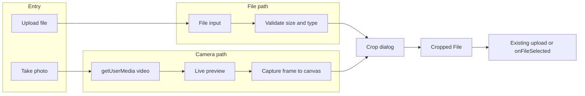

# Camera Capture + Crop for Student and Course Student Picture Uploads

## Goal

- **Desktop:** Add "Take photo" that opens device camera (USB/laptop via `getUserMedia`), live preview, capture, then crop.
- **Mobile:** Keep current file input behavior; optionally offer same camera flow for consistency.
- **Crop:** One shared crop step (aspect ratio, zoom/pan) for both "Upload file" and "Take photo" so all photos are cropped before upload.
- **Reuse:** Existing validation (5MB, image types), existing upload hooks (`useStudentPictureUpload`, `useCourseStudentPictureUpload`), and existing `onFileSelected` / auto-upload behavior. No backend changes.

## Architecture

- **Entry:** Two buttons: "Select Picture" (file input) and "Take photo" (camera dialog).
- **File path:** User picks file → validate (existing) → open crop dialog with file URL → on confirm get cropped `File` → pass to existing `onFileChange` / `handleAutoUpload` / `onFileSelected`.
- **Camera path:** User clicks "Take photo" → camera dialog (getUserMedia) → live video → "Capture" → image blob → open same crop dialog → on confirm get cropped `File` → pass to same existing flow.
- **Existing flow:** Unchanged: `setFile`/`setPreviewUrl`, then either `handleAutoUpload` (edit) or `onFileSelected` (create).

## 1. Dependencies

- Add **react-easy-crop** for crop UI (aspect ratio, zoom, pan, touch-friendly). No extra crop library; optional dependency **react-webcam** can be skipped by implementing a small inline video + canvas capture (fewer deps, same behavior as [CheckinScreen](frontend/src/components/events/CheckinScreen.tsx) camera pattern).

## 2. New shared components (under `frontend/src/components/`)

- **CameraCaptureDialog** (e.g. `frontend/src/components/image-capture/CameraCaptureDialog.tsx`)
  - Controlled: `open`, `onOpenChange`, `onCapture(imageBlob: Blob)`.
  - Use `navigator.mediaDevices.getUserMedia({ video: true })` (or `facingMode: 'user'` on mobile for front camera); render `<video>` mirror-style, show "Capture" and "Cancel".
  - On Capture: draw current video frame to `<canvas>`, then `canvas.toBlob('image/jpeg', quality)` and call `onCapture(blob)`; stop stream and close.
  - On Cancel/close: stop all tracks on the stream.
  - Handle errors: permission denied, no camera, HTTPS requirement (reuse messaging pattern from CheckinScreen). Optional: enumerate devices and allow camera switch on desktop.
  - Use existing [Dialog](frontend/src/components/ui/dialog.tsx) (DialogContent, DialogHeader, DialogFooter).

- **ImageCropDialog** (e.g. `frontend/src/components/image-capture/ImageCropDialog.tsx`)
  - Controlled: `open`, `onOpenChange`, `imageUrl` (blob URL or data URL), `onCropComplete(croppedFile: File)`.
  - Props: `aspectRatio` (e.g. 1 for square profile), optional `maxSizeBytes` (5MB).
  - Use **react-easy-crop**: crop area, zoom slider, pan; on "Done" use `getCroppedImg` (canvas-based crop from react-easy-crop docs) to produce blob → `new File([blob], 'image.jpg', { type: 'image/jpeg' }) `and call `onCropComplete(croppedFile)`. Revoke blob URL on close.
  - Buttons: "Cancel" (close), "Done" (confirm crop). Use existing Dialog and Button components.

- **Optional barrel:** `frontend/src/components/image-capture/index.ts` exporting both dialogs.

## 3. Shared crop utility

- **getCroppedImg(imageUrl, crop, aspectRatio)** returning `Promise<Blob>` (and then wrap as `File` in the dialog). Standard approach: create image element, draw cropped region to canvas, `canvas.toBlob`. Place in e.g. `frontend/src/lib/imageCrop.ts` or inside `ImageCropDialog` as a helper.

## 4. Integration into existing upload components

- **StudentPictureUpload** ([frontend/src/components/students/StudentPictureUpload.tsx](frontend/src/components/students/StudentPictureUpload.tsx))
  - Add state: `cameraDialogOpen`, `cropDialogOpen`, `pendingCropImageUrl` (blob URL for image to crop).
  - Add second button: "Take photo" → set `cameraDialogOpen = true`. In CameraCaptureDialog `onCapture(blob)` → create blob URL, set `pendingCropImageUrl`, close camera dialog, set `cropDialogOpen = true`.
  - For "Select Picture": in `onFileChange`, after validation, instead of immediately setting file and uploading: create blob URL from file, set `pendingCropImageUrl`, set `cropDialogOpen = true`. In ImageCropDialog `onCropComplete(croppedFile)` → revoke `pendingCropImageUrl`, then run the same logic as current `onFileChange` with `croppedFile` (setFile, setPreviewUrl, handleAutoUpload or onFileSelected). So file path goes: file input → validate → crop → existing flow.
  - Ensure one source of truth: after crop, call the same `setFile`/`setPreviewUrl` and either `handleAutoUpload(f)` or `onFileSelected(f)` so upload hooks and create-mode behavior stay unchanged.

- **CourseStudentPictureUpload** ([frontend/src/components/short-term-courses/CourseStudentPictureUpload.tsx](frontend/src/components/short-term-courses/CourseStudentPictureUpload.tsx))
  - Same pattern: "Take photo" + route file input through crop; crop result goes into existing `onFileChange` / `handleAutoUpload` / `onFileSelected` flow. Use same CameraCaptureDialog and ImageCropDialog.

- **StaffPictureUpload** ([frontend/src/components/staff/StaffPictureUpload.tsx](frontend/src/components/staff/StaffPictureUpload.tsx))
  - Same pattern for consistency: "Take photo" + crop for both file and camera; pass cropped `File` into existing upload/onFileSelected logic.

## 5. Validation and constraints

- Keep existing validation (5MB, jpg/png/gif/webp) applied to the **final** file (after crop). In ImageCropDialog, after generating cropped file, if size exceeds 5MB, show toast and do not call `onCropComplete` (or compress/resize in a follow-up). Crop output can default to JPEG with quality ~0.9 to keep size reasonable.
- Crop aspect ratio: 1:1 for profile pictures across all three components.

## 6. Translations

- Add keys (e.g. under `students` and/or `common`) in [frontend/src/lib/translations/types.ts](frontend/src/lib/translations/types.ts) and in en, ar, fa, ps:
  - Take photo / Capture photo / Cancel / Done (crop) / Crop image / Camera access denied / No camera found / Allow camera to take a photo, etc.
- Reuse existing where possible (e.g. `events.uploading`).

## 7. Accessibility and UX

- Camera dialog: aria-label for video and buttons; focus trap inside dialog.
- Crop dialog: ensure zoom/area are keyboard and screen-reader friendly (react-easy-crop has basic support).
- Mobile: "Take photo" can use front camera by default (`facingMode: 'user'`); keep file input with `accept="image/*"` and optional `capture` for quick gallery/camera on mobile.

## 8. File and scope summary

| Item | Action |

|------|--------|

| `package.json` | Add `react-easy-crop` |

| `components/image-capture/CameraCaptureDialog.tsx` | New: getUserMedia, video, capture to blob, error handling |

| `components/image-capture/ImageCropDialog.tsx` | New: react-easy-crop, getCroppedImg, output File |

| `lib/imageCrop.ts` (or inline) | getCroppedImg(imageUrl, crop, aspect) → Blob |

| `StudentPictureUpload.tsx` | Add Take photo button + camera dialog; route file through crop; wire crop result to existing flow |

| `CourseStudentPictureUpload.tsx` | Same |

| `StaffPictureUpload.tsx` | Same (optional but recommended) |

| `translations/*` | New keys for camera/crop copy |

No backend or API changes; upload endpoints and hooks stay as they are.