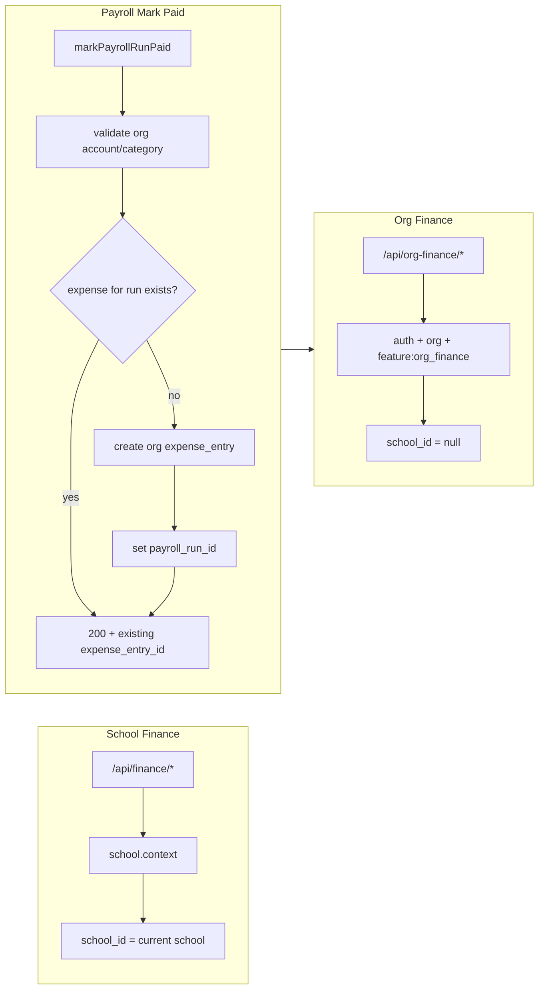

# Org Finance and Payroll Expense Integration

## Summary

- Add a parallel org-scoped finance module under `/api/org-finance/*` and `/org-admin/finance/*`, with all org-finance rows stored as `school_id = null`.
- Keep school finance unchanged under `school.context`; no existing school finance routes, permissions, or screens should change behavior.
- Package org finance behind a new `org_finance` feature/addon, but ship an additive rollout migration that enables it for organizations already entitled to `org_hr_payroll`.
- Integrate payroll so `OrganizationHrController::markPayrollRunPaid` requires an org account selection, creates one linked org expense entry, and is idempotent.

---

## 1. Migrations

### 1.1 Make org-level rows possible (nullable `school_id`)

- **Donors, currencies, exchange_rates**: Add a migration that makes `school_id` nullable again on `donors`, `currencies`, and `exchange_rates`. Leave existing `(organization_id, school_id, code)` (or equivalent) unique constraints in place; they already allow one row per org when `school_id` is null (NULLs are distinct in unique indexes). Do not change NOT NULL on other tables.
- **Reference**: [backend/database/migrations/2025_12_25_000001_add_school_id_to_school_scoped_tables.php](backend/database/migrations/2025_12_25_000001_add_school_id_to_school_scoped_tables.php) currently backfills and then sets NOT NULL for these tables; the new migration only alters the column to allow NULL (e.g. `ALTER TABLE ... ALTER COLUMN school_id DROP NOT NULL`). No backfill of existing data required.

### 1.2 Payroll run → expense link

- Add migration: `expense_entries.payroll_run_id UUID NULL` with foreign key to `payroll_runs(id)` (e.g. ON DELETE SET NULL). Add a partial unique index so that at most one non-deleted expense entry is linked per payroll run, e.g. `CREATE UNIQUE INDEX ... ON expense_entries (payroll_run_id) WHERE payroll_run_id IS NOT NULL AND deleted_at IS NULL`.

---

## 2. Feature and permissions

### 2.1 Feature definition

- Add `org_finance` to feature definitions (e.g. in `feature_definitions` table or equivalent). Treat it as a separate addon for future packaging.

### 2.2 Rollout migration

- Add an additive migration that enables `org_finance` for every organization that currently has `org_hr_payroll` (e.g. insert into `organization_feature_addons` or equivalent so org_finance is enabled wherever org_hr_payroll is).

### 2.3 Permissions

- Add to the central permission seeder (e.g. [backend/database/seeders/PermissionSeeder.php](backend/database/seeders/PermissionSeeder.php) or the migration that syncs permissions):
  - `org_finance.read`
  - `org_finance.create`
- Sync these into existing org roles:
  - `organization_admin`: both `org_finance.read` and `org_finance.create`
  - `organization_hr_admin`: both
  - `payroll_officer`: `org_finance.read` only
- Add `org_finance.read` to the frontend org-admin entry list in [frontend/src/organization-admin/lib/access.ts](frontend/src/organization-admin/lib/access.ts) (`ORG_ADMIN_ENTRY_PERMISSIONS`) so users with only org_finance can enter the org-admin area.
- Add `org_finance.read` / `org_finance.create` to the frontend permission→feature map in [frontend/src/hooks/usePermissions.tsx](frontend/src/hooks/usePermissions.tsx) if that map drives nav/features.

---

## 3. Backend: Org-finance API

### 3.1 Route group

- In [backend/routes/api.php](backend/routes/api.php), create a new route group **outside** the `school.context` group (e.g. alongside the `org-hr` group):
  - Prefix: `org-finance`
  - Middleware: `auth:sanctum`, organization middleware (ensure user has `organization_id`), and `feature:org_finance`.
  - Wrap write routes in `subscription:write`.
  - Apply existing limit middleware where applicable: `limit:finance_accounts`, `limit:income_entries`, `limit:expense_entries` so org and school finance share the same subscription quotas.

### 3.2 Org-only controllers

- Implement new controllers (do not add scope branches into existing school finance controllers):
  - Org finance: accounts, income categories, expense categories, projects, donors, currencies, exchange rates, income entries, expense entries, and reports (dashboard, daily cashbook, income-vs-expense, project summary, donor summary, account balances).
- Each controller must:
  - Resolve `organization_id` from the authenticated user’s profile.
  - Require `org_finance.read` for reads and `org_finance.create` for writes.
  - Always query and create with `whereNull('school_id')` / `school_id = null` for the relevant tables (accounts, categories, projects, donors, entries; and for org-level currencies/exchange_rates once they support null `school_id`).

### 3.3 Shared report logic

- Extract the report calculations from [backend/app/Http/Controllers/FinanceReportController.php](backend/app/Http/Controllers/FinanceReportController.php) into a scope-aware service (e.g. `FinanceReportingService`) that accepts `(organizationId, schoolId|null, targetCurrencyId|null)`. When `schoolId` is null, the service uses only org-level data (accounts/categories/entries/currencies with `school_id` null).
- Keep the existing `FinanceReportController` using this service with `getCurrentSchoolId($request)` so school finance behavior is unchanged.
- Add an org-finance report controller (or methods under a single org-finance controller) that calls the same service with `schoolId = null` and org-finance permission checks.

---

## 4. Backend: Payroll → org expense

### 4.1 Mark-paid request body

- Change `POST /api/org-hr/payroll/runs/{id}/mark-paid` from empty body to:
  - Required: `account_id` (UUID of an org finance account).
  - Optional: `expense_category_id` (UUID of an org expense category). If omitted, resolve the default org-level “Payroll” expense category (by name or a seeded code).

### 4.2 Validation and rules

- In `OrganizationHrController::markPayrollRunPaid`:
  - Validate that `account_id` (and if present `expense_category_id`) belong to the same organization and are org-level (`school_id` is null). Reject school-scoped accounts/categories and cross-org IDs.
  - Optionally validate that the account has sufficient balance for the run’s total net (or document that overdraft is allowed; either way, document the rule).

### 4.3 Idempotency and link

- Before creating an expense: check whether an expense entry already exists for this payroll run (e.g. `expense_entries` where `payroll_run_id = $run->id` and `deleted_at` is null). If one exists, return `200` with the existing `expense_entry_id` and do not create a duplicate; still ensure run/period status is `paid`.
- When creating a new expense entry:
  - Set `organization_id`, `school_id = null`, `account_id`, `expense_category_id`, `amount` = run total net, `date` = payroll period `pay_date` if present, else today. Set `description`/`reference_no` from run name and period. Set `status` = approved.
  - Set `expense_entries.payroll_run_id` = run id.
  - Then update run and period status to `paid` in the same transaction.

### 4.4 Payroll run payloads

- Extend payroll run list and run-detail API responses to include optional `expense_entry_id` and `paid_at` (or equivalent) for audit visibility. Backend should populate these when a linked expense exists and when the run was marked paid.

---

## 5. Frontend: API client and hooks

### 5.1 No `school_id` on org-finance

- In [frontend/src/lib/api/client.ts](frontend/src/lib/api/client.ts), ensure all requests to `/org-finance/`* are exempt from automatic `school_id` injection (and do not inherit selected-school query params). Same pattern as for `/org-hr/`* or `/staff` list: detect path and skip adding `school_id`.

### 5.2 orgFinanceApi

- Add `orgFinanceApi` (or equivalent) with endpoints mirroring school finance: accounts, income categories, expense categories, projects, donors, income entries, expense entries, plus org-level currencies, exchange rates, dashboard, and report endpoints. All under the same base path used by the backend (e.g. `/org-finance/...`).

### 5.3 useOrgFinance* hooks

- Add hooks (e.g. in `frontend/src/hooks/useOrgFinance.ts` or `hooks/orgFinance/`) for accounts, categories, projects, donors, currencies, exchange rates, income entries, expense entries, dashboard, and reports. Reuse existing finance domain types and mappers where the response shape matches; only the API base and “no school” behavior differ.
- Query keys should include `profile.organization_id` and `profile.default_school_id ?? null` for cache isolation, but the actual requests must not send `school_id`.

---

## 6. Frontend: Org-admin finance UI

### 6.1 Routes and nav

- Under org-admin, add routes for: dashboard, accounts, income categories, expense categories, projects, donors, currencies, exchange rates, income entries, expense entries, reports (or a reports tab on dashboard). Paths e.g. `/org-admin/finance`, `/org-admin/finance/accounts`, etc.
- In [frontend/src/organization-admin/components/OrganizationAdminLayout.tsx](frontend/src/organization-admin/components/OrganizationAdminLayout.tsx), add a “Finance” section after HR, visible only when the user has `org_finance.read`.

### 6.2 Pages

- Build org-finance screens by copying the current school finance page structure ([frontend/src/pages/finance/](frontend/src/pages/finance/)) and swapping in org-finance hooks, org-finance API, and org-admin breadcrumbs. Do not refactor school finance into a shared generic UI in this phase except for small local helpers if they materially reduce duplication.

---

## 7. Frontend: Payroll “Mark paid” dialog

- Update [frontend/src/pages/organization/hr/OrganizationHrPayrollPage.tsx](frontend/src/pages/organization/hr/OrganizationHrPayrollPage.tsx) so that “Mark paid” opens a dialog that:
  - Requires the user to select an org finance account (required).
  - Optionally selects or defaults the expense category to “Payroll” when available (from org expense categories).
  - Submits the new mark-paid payload `{ account_id, expense_category_id? }`.
  - On success, invalidates both org-HR and org-finance relevant queries (e.g. payroll runs, run detail, expense entries, account balances).

---

## 8. Types and API contract

### 8.1 REST

- New surface: `/api/org-finance/`* for accounts, categories, projects, donors, currencies, exchange rates, income entries, expense entries, dashboard, and reports.
- `POST /api/org-hr/payroll/runs/{id}/mark-paid`: body `{ "account_id": "uuid", "expense_category_id": "uuid?" }`.
- Payroll run responses: add optional `expense_entry_id` and `paid_at`.
- Expense entry responses: add optional `payroll_run_id` (and ensure API/types expose it).

### 8.2 Frontend types

- Extend org-HR payroll run types to include `expenseEntryId` and `paidAt` (or snake_case as returned by API, then mapped in domain).
- Extend expense entry types (API/domain) with optional `payrollRunId` / `payroll_run_id`.

---

## 9. Seed data

- Ensure a default org-level expense category “Payroll” exists (seed per organization when org_finance is enabled, or create on first use when processing mark-paid without `expense_category_id`). Document the name/code used so the backend can resolve it.

---

## 10. Test plan

- **Access and scope**
  - Org-finance routes reject users without org context, without `org_finance.`*, or without org-admin-level entry (e.g. missing from `canAccessOrgAdminArea` when user has only school permissions). School finance routes still require school context and unchanged behavior.
- **Data isolation**
  - Org-finance CRUD writes only `school_id = null`. School finance never returns org-level rows. Org reports aggregate only org-level rows.
- **Currencies and rates**
  - Org-level currencies and exchange rates work for org accounts, entries, reports, and for payroll-created expenses, without any school context. No borrowing of school-scoped currency data in this phase.
- **Mark paid**
  - Mark-paid with valid org account (and optional category) creates exactly one linked org expense entry, sets run/period to `paid`, and is idempotent on repeat calls (second call returns 200 with same expense_entry_id, no duplicate expense).
  - Mark-paid rejects: school-scoped account or category, cross-org IDs, and (if implemented) insufficient balance.
- **Frontend**
  - Org-admin finance nav and routes are permission-gated. Org-finance requests never send `school_id`. After successful mark-paid, payroll dialog closes and both payroll state and org-finance expense/account state refresh (invalidate/refetch).

---

## 11. Assumptions

- `org_finance` is a separate addon for future packaging; the rollout migration enables it for organizations that already have `org_hr_payroll`.
- Org finance includes org-level currencies and exchange rates in v1; borrowing school-scoped currency data is explicitly out of scope.
- Optional org→school transfer workflows are deferred to a later phase.

---

## 12. Files to add or touch (checklist)

| Area           | Action                                                                                                                                                                           |
| -------------- | -------------------------------------------------------------------------------------------------------------------------------------------------------------------------------- |
| Migrations     | New migration: nullable `school_id` for `donors`, `currencies`, `exchange_rates`.                                                                                                |
| Migrations     | New migration: `expense_entries.payroll_run_id` + FK + partial unique index.                                                                                                     |
| Migrations     | New migration: add `org_finance` to feature definitions; enable for orgs with `org_hr_payroll`.                                                                                  |
| Permissions    | Seeder/migration: add `org_finance.read`, `org_finance.create`; assign to org roles; add `org_finance.read` to org-admin entry in `access.ts` and permission map.                |
| Backend routes | New `org-finance` route group (auth, org, feature, subscription:write, limits).                                                                                                  |
| Backend        | New org-finance controllers (accounts, categories, projects, donors, currencies, exchange rates, entries, reports) with org-only scope.                                          |
| Backend        | Extract `FinanceReportController` logic into scope-aware service; use from school controller and org report controller.                                                          |
| Backend        | Extend `OrganizationHrController::markPayrollRunPaid`: body validation, idempotency, create expense, link payroll_run_id; extend run list/detail with expense_entry_id, paid_at. |
| Frontend API   | Exempt `/org-finance/`* from school_id; add `orgFinanceApi` and `useOrgFinance`* hooks.                                                                                          |
| Frontend       | Org-admin Finance section and routes; new org-finance pages (copy from school finance, swap hooks/breadcrumbs).                                                                  |
| Frontend       | Payroll page: Mark-paid dialog (account required, category default Payroll); invalidate org-HR + org-finance.                                                                    |
| Types          | Payroll run: `expense_entry_id`, `paid_at`. Expense entry: `payroll_run_id`.                                                                                                     |

