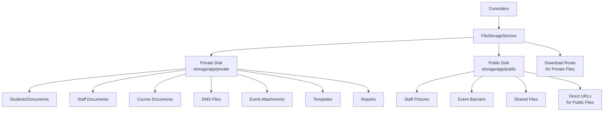

# Standardized File Storage System Implementation

## Overview

This plan implements a centralized file storage system with:

- Consistent folder structure: `organizations/{org_id}/schools/{school_id}/resource_type/...`
- Public/Private file separation (public disk for direct URLs, private disk for sensitive files)
- School-scoped organization (DMS and events under school scope)
- Type-safe methods for each resource type
- UUID-based file naming

## Architecture




## Implementation Steps

### Phase 1: Create Core Service

#### 1.1 Create FileStorageService

- **File**: `backend/app/Services/Storage/FileStorageService.php`
- **Actions**:
- Create service class with all storage methods
- Implement public/private disk separation
- Add methods for: students, staff, courses, DMS, events, templates, reports
- Include helper methods: delete, getUrl, download, fileExists, etc.
- Add bulk operations: getSchoolFiles, getOrganizationFiles, cleanupOldFiles

#### 1.2 Create Storage Download Route

- **File**: `backend/routes/api.php`
- **Actions**:
- Add route: `Route::get('/storage/download/{path}', [StorageController::class, 'download'])->middleware('auth:sanctum')`
- Create `StorageController` with download method that:
    - Validates base64-encoded path
    - Checks file exists
    - Verifies user has access (organization check)
    - Returns file download response

#### 1.3 Create StorageController

- **File**: `backend/app/Http/Controllers/StorageController.php`
- **Actions**:
- Implement `download()` method for private files
- Add organization access validation
- Handle file not found errors
- Support MIME type detection

### Phase 2: Update Controllers (Priority Order)

#### 2.1 StudentController

- **File**: `backend/app/Http/Controllers/StudentController.php`
- **Methods to update**:
- `uploadPicture()` - Use `storeStudentPicture()` (PRIVATE)
- `getPicture()` - Use `getFileUrl()` or `downloadFile()`
- **Changes**:
- Replace direct `move_uploaded_file()` with `FileStorageService`
- Update path structure to new format
- Keep backward compatibility during migration

#### 2.2 StudentDocumentController

- **File**: `backend/app/Http/Controllers/StudentDocumentController.php`
- **Methods to update**:
- `store()` - Use `storeStudentDocument()` (PRIVATE)
- `download()` - Use `downloadFile()`
- `destroy()` - Use `deleteFile()`
- **Changes**:
- Replace `Storage::disk('local')->put()` with service
- Update path to include school_id

#### 2.3 StaffController

- **File**: `backend/app/Http/Controllers/StaffController.php`
- **Methods to update**:
- `uploadPicture()` - Use `storeStaffPicturePublic()` (PUBLIC)
- `uploadDocument()` - Use `storeStaffDocument()` (PRIVATE)
- **Changes**:
- Replace `storeAs('staff-files', ...)` with service
- Update to use public disk for pictures, private for documents

#### 2.4 StaffDocumentController

- **File**: `backend/app/Http/Controllers/StaffDocumentController.php`
- **Methods to update**:
- `store()` - Use `storeStaffDocument()` (PRIVATE)
- `download()` - Use `downloadFile()`
- `destroy()` - Use `deleteFile()`
- **Changes**:
- Replace `storeAs('staff-files', ...)` with service
- Move from public to private disk for documents

#### 2.5 CourseDocumentController

- **File**: `backend/app/Http/Controllers/CourseDocumentController.php`
- **Methods to update**:
- `store()` - Use `storeCourseDocument()` (PRIVATE)
- `download()` - Use `downloadFile()`
- `destroy()` - Use `deleteFile()`
- **Changes**:
- Replace `storeAs('course-documents/...')` with service
- Update path to include school_id

#### 2.6 DocumentFilesController (DMS)

- **File**: `backend/app/Http/Controllers/Dms/DocumentFilesController.php`
- **Methods to update**:
- `store()` - Use `storeDmsFile()` (PRIVATE, school-scoped)
- `download()` - Use `downloadFile()`
- **Changes**:
- Replace `$file->store('document-files')` with service
- Update path to: `organizations/{org_id}/schools/{school_id}/dms/{type}/{doc_id}/files/`
- Ensure school_id is extracted from document

#### 2.7 IdCardTemplateController

- **File**: `backend/app/Http/Controllers/IdCardTemplateController.php`
- **Methods to update**:
- `store()` - Use `storeIdCardTemplateBackground()` (PRIVATE)
- `update()` - Use `storeIdCardTemplateBackground()` (PRIVATE)
- `getBackgroundImage()` - Use `downloadFile()` or `getFileUrl()`
- `destroy()` - Use `deleteFile()`
- **Changes**:
- Replace `storeAs('id-card-templates/...')` with service
- Update path to include school_id

#### 2.8 CertificateTemplateController

- **File**: `backend/app/Http/Controllers/Certificates/CertificateTemplateController.php`
- **Methods to update**:
- `store()` - Use `storeCertificateTemplateBackground()` (PRIVATE)
- `update()` - Use `storeCertificateTemplateBackground()` (PRIVATE)
- `getBackgroundImage()` - Use `downloadFile()` or `getFileUrl()`
- `destroy()` - Use `deleteFile()`
- **Changes**:
- Replace `store('certificate-templates/...')` with service
- Update path to include school_id

#### 2.9 Report Services

- **Files**: 
- `backend/app/Services/Reports/PdfReportService.php`
- `backend/app/Services/Reports/ExcelReportService.php`
- **Methods to update**:
- `saveToFile()` methods - Use `storeReport()` (PRIVATE)
- **Changes**:
- Replace direct `storage_path('app/reports')` with service
- Update path to include organization_id and school_id

### Phase 3: Event Support (Future)

#### 3.1 Event File Storage

- **When events feature is implemented**:
- Add `storeEventAttachment()` (PRIVATE)
- Add `storeEventPhoto()` (PRIVATE)
- Add `storeEventBanner()` (PUBLIC)
- Add `storeEventThumbnail()` (PUBLIC)
- **Path structure**: `organizations/{org_id}/schools/{school_id}/events/{event_id}/...`

### Phase 4: Migration Strategy

#### 4.1 Create Migration Service

- **File**: `backend/app/Services/Storage/FileMigrationService.php`
- **Actions**:
- Create methods to migrate existing files to new structure
- Map old paths to new paths
- Update database records with new paths
- Handle both public and private disk migrations

#### 4.2 Create Migration Command

- **File**: `backend/app/Console/Commands/MigrateFileStorage.php`
- **Actions**:
- Create artisan command: `php artisan storage:migrate`
- Options:
    - `--dry-run` - Show what would be migrated
    - `--resource=students` - Migrate specific resource type
    - `--organization={id}` - Migrate specific organization
- Steps:

    1. Scan old storage locations
    2. Map to new structure
    3. Move files (or copy for safety)
    4. Update database records
    5. Verify migrations
    6. Clean up old files (optional flag)

#### 4.3 Path Mapping

- **Old → New path mappings**:
- `{org_id}/students/{id}/pictures/{file}` → `organizations/{org_id}/schools/{school_id}/students/{id}/pictures/{uuid}.{ext}`
- `staff-files/{org_id}/...` → `organizations/{org_id}/schools/{school_id}/staff/...`
- `course-documents/{org_id}/...` → `organizations/{org_id}/schools/{school_id}/courses/...`
- `document-files/{auto}` → `organizations/{org_id}/schools/{school_id}/dms/{type}/{doc_id}/files/...`
- `id-card-templates/{org_id}/...` → `organizations/{org_id}/schools/{school_id}/templates/id-cards/...`
- `certificate-templates/{org_id}/...` → `organizations/{org_id}/schools/{school_id}/templates/certificates/...`
- `reports/{file}` → `organizations/{org_id}/schools/{school_id}/reports/{report_key}/...`

### Phase 5: Testing & Validation

#### 5.1 Unit Tests

- **File**: `backend/tests/Unit/FileStorageServiceTest.php`
- **Test cases**:
- File storage for each resource type
- Public vs private disk selection
- File deletion
- URL generation (public vs private)
- Path building with null school_id
- File name sanitization
- Bulk operations

#### 5.2 Integration Tests

- **File**: `backend/tests/Feature/FileStorageTest.php`
- **Test cases**:
- Student picture upload/download
- Student document upload/download
- Staff picture upload (public URL)
- Staff document upload (private download)
- DMS file upload (school-scoped)
- Template background upload
- Report generation and storage
- Organization isolation
- School isolation

#### 5.3 Manual Testing Checklist

- [ ] Upload student picture (verify private storage)
- [ ] Upload student document (verify private storage)
- [ ] Upload staff picture (verify public URL works)
- [ ] Upload staff document (verify private download)
- [ ] Upload course document (verify school scope)
- [ ] Upload DMS file (verify school scope)
- [ ] Upload ID card template (verify school scope)
- [ ] Upload certificate template (verify school scope)
- [ ] Generate report (verify storage)
- [ ] Download private files (verify auth required)
- [ ] Access public files (verify direct URL)
- [ ] Delete files (verify cleanup)

### Phase 6: Cleanup & Documentation

#### 6.1 Remove Old Code

- Remove direct `Storage::` calls from controllers
- Remove `move_uploaded_file()` usage
- Remove old path building logic
- Clean up unused helper methods

#### 6.2 Update Documentation

- Document new folder structure
- Document public vs private usage guidelines
- Add examples for each resource type
- Update API documentation

#### 6.3 Update .cursorrules

- Add FileStorageService usage patterns
- Document public vs private decision criteria
- Add examples for new file operations

## File Structure After Implementation

```javascript
backend/app/
├── Services/
│   └── Storage/
│       ├── FileStorageService.php          # Main service
│       └── FileMigrationService.php         # Migration helper
├── Http/
│   └── Controllers/
│       └── StorageController.php            # Download route handler
└── Console/
    └── Commands/
        └── MigrateFileStorage.php           # Migration command
```


## Key Implementation Details

### Public vs Private Decision Matrix

| Resource Type | File Category | Disk | Reason ||--------------|---------------|------|--------|| Students | Pictures | Private | Sensitive data || Students | Documents | Private | Sensitive data || Staff | Pictures | Public | Display in UI, non-sensitive || Staff | Documents | Private | Sensitive data || Courses | Documents | Private | May contain sensitive info || DMS | All files | Private | Sensitive documents || Events | Attachments | Private | May contain sensitive info || Events | Photos | Private | May contain sensitive info || Events | Banners | Public | Public display || Events | Thumbnails | Public | Public display || Templates | Backgrounds | Private | Internal use || Reports | All | Private | Sensitive data |

### School ID Handling

- **Always include school_id in path** when available
- **Handle null school_id** gracefully (organization-level files)
- **Extract school_id from resource** (student, staff, course, etc.)
- **Validate school belongs to organization** before storage

### Backward Compatibility

- **Keep old paths working** during migration period
- **Support both old and new paths** in download methods
- **Gradual migration** - update one controller at a time
- **Migration command** handles path updates in database

## Rollout Strategy

1. **Week 1**: Create service and StorageController
2. **Week 2**: Update StudentController and StudentDocumentController
3. **Week 3**: Update StaffController and StaffDocumentController
4. **Week 4**: Update CourseDocumentController and DMS controllers
5. **Week 5**: Update Template controllers and Report services
6. **Week 6**: Run migration command and verify
7. **Week 7**: Testing and cleanup
8. **Week 8**: Documentation and final cleanup

## Success Criteria

- [ ] All file operations use FileStorageService
- [ ] Consistent folder structure across all resources
- [ ] Public files accessible via direct URLs
- [ ] Private files require authentication
- [ ] DMS and events under school scope
- [ ] All existing files migrated to new structure
- [ ] All tests passing
- [ ] No direct Storage:: calls in controllers
- [ ] Documentation updated

## Risk Mitigation

- **Data Loss**: Migration command creates backups before moving files