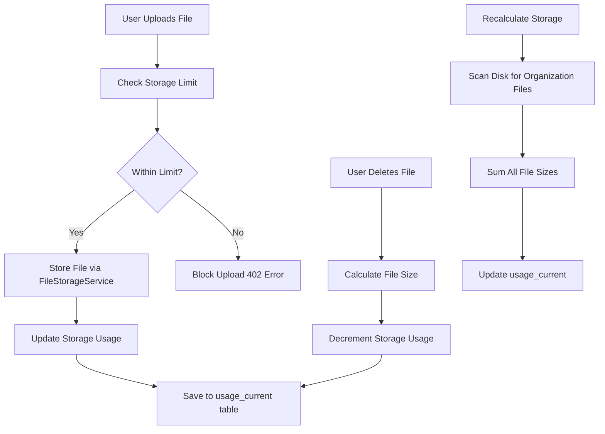

# Storage Limits Implementation Plan

## Overview

Implement comprehensive storage limits enforcement for all file uploads across the entire application. Storage will be tracked in GB per organization, checked before every file upload, and updated when files are added or deleted.

## Architecture



## Implementation Steps

### 1. Add Storage Calculation to UsageTrackingService

**File**: `backend/app/Services/Subscription/UsageTrackingService.php`

- Add `calculateStorageUsage()` method to calculate total storage in GB from disk
- Add `getStorageUsage()` method to get storage from `usage_current` table (fallback to calculation if not cached)
- Add `incrementStorageUsage()` method to add file size to storage usage
- Add `decrementStorageUsage()` method to subtract file size from storage usage
- Add `canStoreFile()` method to check if file can be stored (checks limit before upload)
- Update `getUsage()` to handle `storage_gb` resource key
- Update `recalculateUsage()` to recalculate storage usage from disk

**Storage Calculation Logic**:

- Scan all files in `organizations/{org_id}/` directory (both private and public disks)
- Sum all file sizes in bytes, convert to GB (divide by 1,073,741,824)
- Cache result in `usage_current` table for performance
- Recalculate periodically or on demand

### 2. Add Storage Checks to FileStorageService

**File**: `backend/app/Services/Storage/FileStorageService.php`

- Inject `UsageTrackingService` or `FeatureGateService` in constructor
- Add `checkStorageLimit()` method to validate storage before upload
- Modify `storeFile()` to check storage limit before storing
- Throw exception with 402 status if limit exceeded
- Return file size after successful storage for usage tracking

**Storage Check Pattern**:

```php
// Before storing file
$fileSizeInBytes = $file->getSize();
$fileSizeInGB = $fileSizeInBytes / 1073741824; // Convert to GB

// Check if adding this file would exceed limit
$check = $this->usageTrackingService->canStoreFile($organizationId, $fileSizeInGB);

if (!$check['allowed']) {
    throw new \Exception($check['message'], 402);
}

// Store file
$path = $this->storeFile($file, $path, $disk);

// Update usage after successful storage
$this->usageTrackingService->incrementStorageUsage($organizationId, $fileSizeInGB);

return $path;
```

### 3. Update All File Upload Methods in FileStorageService

**File**: `backend/app/Services/Storage/FileStorageService.php`Update all storage methods to check limits and update usage:

- `storeStudentPicture()` - Check limit, store, update usage
- `storeStudentDocument()` - Check limit, store, update usage
- `storeStaffPicturePublic()` - Check limit, store, update usage
- `storeStaffPicturePrivate()` - Check limit, store, update usage
- `storeStaffDocument()` - Check limit, store, update usage
- `storeCourseDocument()` - Check limit, store, update usage
- `storeExamDocument()` - Check limit, store, update usage
- `storeFinanceDocument()` - Check limit, store, update usage
- `storeDmsFile()` - Check limit, store, update usage
- `storeEventAttachment()` - Check limit, store, update usage
- `storeEventPhoto()` - Check limit, store, update usage
- `storeEventBannerPublic()` - Check limit, store, update usage
- `storeEventThumbnailPublic()` - Check limit, store, update usage
- `storeIdCardTemplateBackground()` - Check limit, store, update usage
- `storeCertificateTemplateBackground()` - Check limit, store, update usage
- `storeReport()` - Check limit, store, update usage
- `storeReportFile()` - Check limit, store, update usage

**Update Pattern for Each Method**:

```php
public function storeStudentPicture(
    UploadedFile $file,
    string $organizationId,
    string $studentId,
    string $schoolId
): string {
    // Check storage limit before storing
    $this->checkStorageLimit($file, $organizationId);
    
    $path = $this->buildPath($organizationId, $schoolId, self::PATH_STUDENTS, $studentId, 'pictures');
    $filePath = $this->storeFile($file, $path, self::DISK_PRIVATE);
    
    // Update storage usage after successful storage
    $this->updateStorageUsage($file, $organizationId);
    
    return $filePath;
}
```

### 4. Update File Deletion to Decrement Storage

**File**: `backend/app/Services/Storage/FileStorageService.php`

- Modify `deleteFile()` to get file size before deletion
- Decrement storage usage after successful deletion
- Handle errors gracefully (file might not exist)

**Deletion Pattern**:

```php
public function deleteFile(string $path, string $disk = self::DISK_PRIVATE): bool
{
    // Get file size before deletion for usage tracking
    $fileSize = $this->getFileSize($path, $disk);
    
    // Delete file
    $deleted = Storage::disk($disk)->delete($path);
    
    if ($deleted && $fileSize) {
        // Extract organization_id from path: organizations/{org_id}/...
        $organizationId = $this->extractOrganizationIdFromPath($path);
        if ($organizationId) {
            $fileSizeInGB = $fileSize / 1073741824;
            $this->usageTrackingService->decrementStorageUsage($organizationId, $fileSizeInGB);
        }
    }
    
    return $deleted;
}
```

### 5. Add Storage Usage to Subscription Status API

**File**: `backend/app/Http/Controllers/SubscriptionController.php`

- Update `status()` method to include `storage_gb` usage
- Return storage usage with current, limit, remaining, percentage

**Response Format**:

```json
{
  "usage": {
    "storage_gb": {
      "current": 2.5,
      "limit": 5,
      "remaining": 2.5,
      "percentage": 50,
      "warning": false,
      "unlimited": false
    }
  }
}
```

### 6. Add Storage Usage to Frontend

**File**: `frontend/src/hooks/useSubscription.tsx`

- Update `useUsage()` hook to include `storage_gb` in usage data
- Storage usage will be automatically included from backend

**File**: `frontend/src/components/subscription/UsageLimitWarning.tsx`

- Already supports any resource key, so `storage_gb` will work automatically
- Update UI to show storage in GB format (not count)

**File**: `frontend/src/pages/Subscription.tsx`

- Display storage usage in subscription page
- Show storage warnings when approaching limit
- Display upgrade options when limit reached

### 7. Add Storage Limit Configuration

**File**: `backend/config/subscription_features.php`

- Verify `storage_gb` is in `limit_feature_map`
- Storage doesn't require a feature (it's always available), so it should be mapped to a core feature or have special handling

**Update**: Add storage to limit_feature_map if not present:

```php
'storage_gb' => null, // No feature required - storage is always available
```

**File**: `backend/app/Services/Subscription/UsageTrackingService.php`

- Update `canCreate()` to handle storage_gb (it doesn't need feature check)
- Storage limits apply to all organizations regardless of plan features

### 8. Update Recalculation Command

**File**: `backend/app/Console/Commands/CreateUsageSnapshots.php` or new command

- Add storage recalculation to usage recalculation
- Calculate storage from disk when recalculating usage
- Store result in `usage_current` table

### 9. Handle Edge Cases

**Edge Cases to Handle**:

1. **File upload fails after usage increment**: 

- Use database transactions or rollback usage on failure
- Or: Increment usage only after successful file storage

2. **File deletion fails after usage decrement**:

- Only decrement usage after successful file deletion

3. **Storage recalculation while files being uploaded**:

- Use locks or queue jobs to prevent race conditions

4. **Storage limit is 0 (disabled)**:

- Check for `limit === 0` and block all uploads with appropriate message

5. **Storage limit is -1 (unlimited)**:

- Skip storage checks when limit is -1

6. **Files in both public and private disks**:

- Calculate storage from both disks for accurate total

### 10. Performance Considerations

**Caching Strategy**:

- Cache storage usage in `usage_current` table
- Recalculate periodically (daily cron job)
- Allow manual recalculation via API

**Optimization**:

- For large organizations, calculate storage in background jobs
- Use database transactions for atomic updates
- Batch file size queries when possible

## File Changes Summary

### Backend Files to Modify:

1. **`backend/app/Services/Subscription/UsageTrackingService.php`**

- Add storage calculation methods
- Update `getUsage()` for storage_gb
- Add `canStoreFile()` method
- Add `incrementStorageUsage()` and `decrementStorageUsage()`
- Update `recalculateUsage()` to include storage

2. **`backend/app/Services/Storage/FileStorageService.php`**

- Inject `UsageTrackingService` or `FeatureGateService`
- Add `checkStorageLimit()` method
- Update all `store*()` methods to check limits
- Update `deleteFile()` to decrement usage
- Add `extractOrganizationIdFromPath()` helper

3. **`backend/app/Http/Controllers/SubscriptionController.php`**

- Ensure `storage_gb` is included in status response

4. **`backend/config/subscription_features.php`**

- Verify `storage_gb` is in `limit_feature_map` with null (no feature required)

5. **`backend/app/Console/Commands/CreateUsageSnapshots.php`** (or new command)

- Add storage recalculation

### Frontend Files (Minimal Changes Needed):

1. **`frontend/src/hooks/useSubscription.tsx`**

- No changes needed (already supports all resource keys)

2. **`frontend/src/components/subscription/UsageLimitWarning.tsx`**

- Update to format GB values properly

3. **`frontend/src/pages/Subscription.tsx`**

- Display storage usage section

## Testing Checklist

- [ ] Test file uploads with storage limit reached (should block)
- [ ] Test file uploads within limit (should allow)
- [ ] Test file deletion updates storage usage correctly
- [ ] Test storage recalculation from disk
- [ ] Test storage usage display in UI
- [ ] Test storage warnings at 80% threshold
- [ ] Test storage limits for all file types (avatars, documents, etc.)
- [ ] Test with unlimited storage (-1 limit)
- [ ] Test with disabled storage (0 limit)
- [ ] Test storage tracking across both public and private disks
- [ ] Test concurrent file uploads (race conditions)
- [ ] Test storage usage after file deletion
- [ ] Test storage recalculation accuracy

## Acceptance Criteria

- ✅ All file uploads check storage limits before storing
- ✅ Storage usage updates correctly when files are added/deleted
- ✅ Storage limits are enforced via 402 error when exceeded
- ✅ Storage usage is displayed in subscription page
- ✅ Storage warnings shown at 80% threshold
- ✅ Storage recalculation works accurately from disk